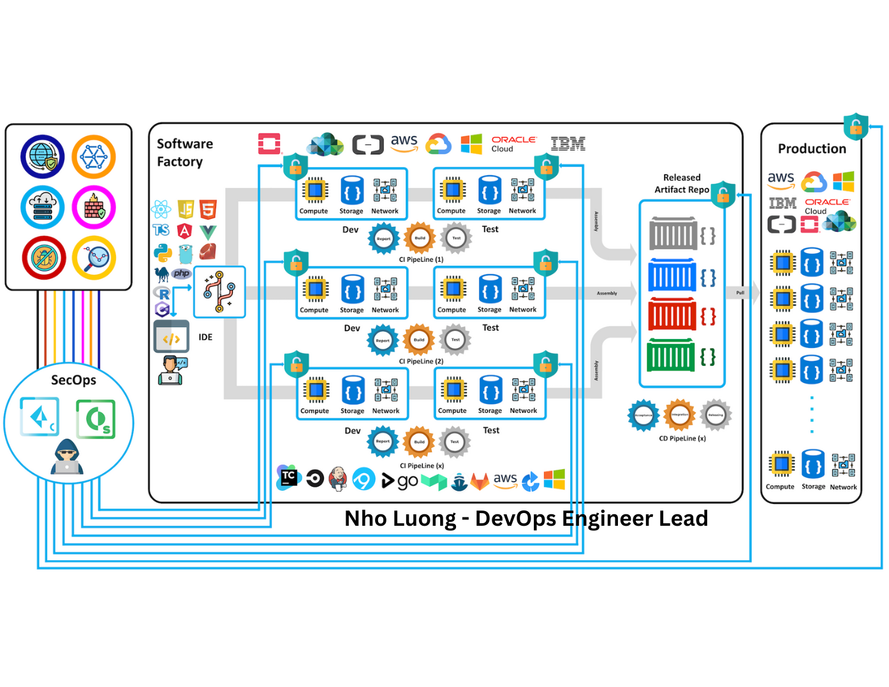
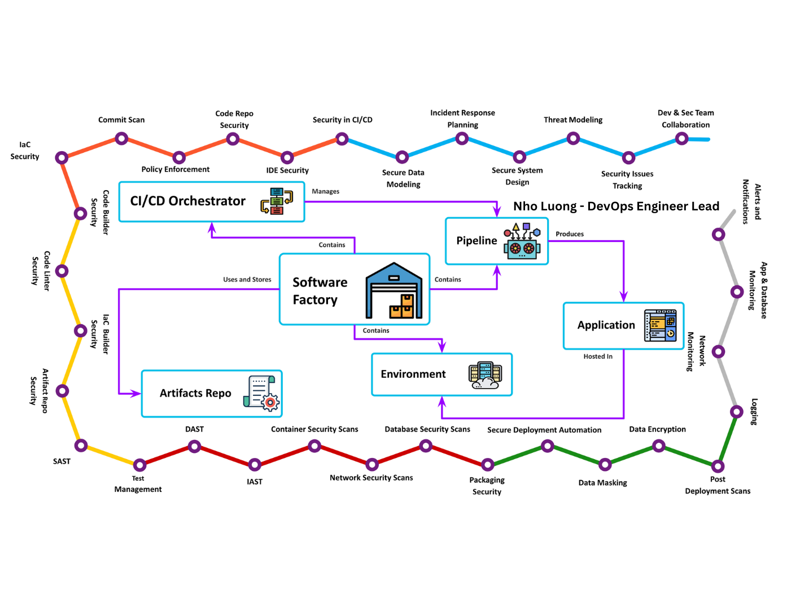
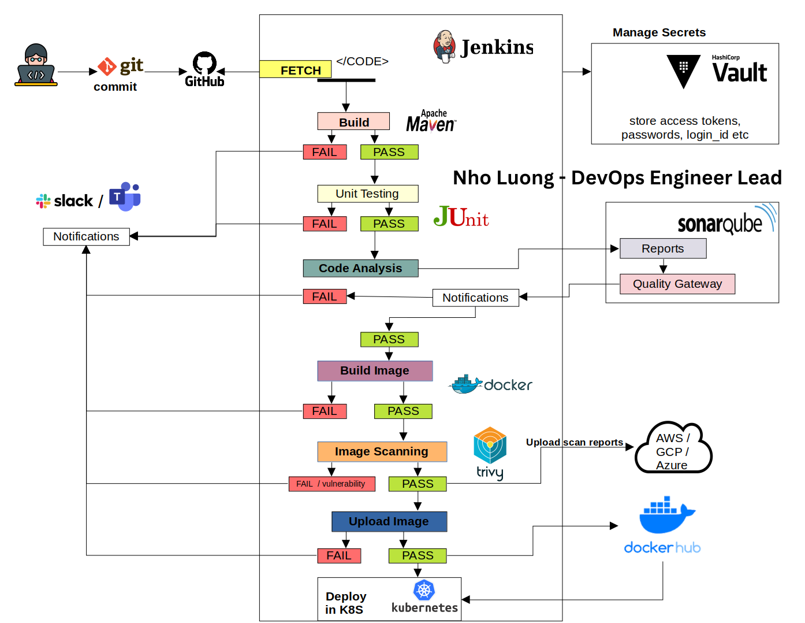

### [View all Roadmaps](https://github.com/nholuongut/all-roadmaps) &nbsp;&middot;&nbsp; [Best Practices](https://github.com/nholuongut/all-roadmaps/blob/main/public/best-practices/) &nbsp;&middot;&nbsp; [Questions](https://www.linkedin.com/in/nholuong/)
 

# **About Me🇻**
- ✍️ Blogger
- ⚽ Football Player
- ♾️ DevOps Engineer
- ⭐ Open-source Contributor
- 😄 Pronouns: Mr. Nho Luong
- 📚 Lifelong Learner | Always exploring something new
- 📫 How to reach me: luongutnho@hotmail.com

  

## <h2 align="center"><strong>Expert in DevOps/DevSecOps • CI/CD • Cloud Management • Security • Azure • AWS • GCP </strong></h2>

I am a results-driven DevOps Engineer Lead with over 10 years of experience in IT infrastructure and over a decade leading cloud-based and on-premise DevOps transformations. My core strengths lie in CI/CD pipeline automation, cloud infrastructure management, and security-first DevSecOps practices.

I specialize in designing and implementing scalable, secure, and resilient systems across Microsoft Azure, Amazon Web Services (AWS), and Google Cloud Platform (GCP). With hands-on expertise in cloud governance, infrastructure as code (IaC), and continuous delivery, I help organizations modernize operations, improve deployment velocity, and enforce security compliance at scale.

My approach blends deep technical knowledge with strategic planning to deliver robust DevOps pipelines, ensure cloud-native security, and empower teams through automation, monitoring, and self-service tooling.

Ask me **about DevOps & DevSecOps with CI/CD Pipelines, Cloud Computing (AWS, Microsoft Azure), Docker, Kubernetes, Python, Linux System Administration, Git, Docker, Terraform, Jenkins, Ansible, Bash Scripting, Cybersecurity, Web Services, MongoDB, MySQL, SQL, React.js, HTML, CSS, Java, C++, Data Structures, C (Programming Language).**

### 🔭 I’m currently working on🇻
- [MLOps - Machine Learning Operations](https://github.com/nholuongut/MLOps-references)
- [GenAIOps-project-template](https://github.com/nholuongut/GenAIOps-project-template)
- [Deep Learning tutorials](https://github.com/nholuongut/Deep-Learning-tutorials)
- [All In One LLMS](https://github.com/nholuongut/all-in-one-llm)
- [Azure AI ](https://github.com/Azure/enterprise-azureai)

### 🌱 I’m currently Pratices on 🇻
- [Generative AI Operations Solution Accelerator](https://github.com/nholuongut/GenAIOps)
- [Azure ML Service and Azure DevOps](https://github.com/nholuongut/DevOpsForAI)
- [AI application using Azure](https://github.com/nholuongut/AI-application-with-DevOps)

### 📝 I regularly write articles on 🇻
- [My Linkedin Recent Activity](https://www.linkedin.com/in/nholuong/recent-activity/all/)

# **Project Architecture Overviews🇻**

# **DevSecOps Orchestrator Overviews🇻**

# **Pipeline Fullflow Overviews🇻**

# **My Projects**🇻
-  My Github Repositories [**GitHub Repositories**](https://github.com/nholuongut?tab=repositories) for a central DevOps learning and practical with all my projects.
- 🏗️ Below are my highlight repositories🇻:
   - ➡️ [**devops-basics**](https://github.com/nholuongut/devops-basics): Practical and document place for DevOps skill.
   - ➡️ [**devops-toolkit**](https://github.com/nholuongut/devops-toolkit): Container image for an all-in-one DevOps environment with popular tools
   - ➡️ [**devops-notes**](https://github.com/nholuongut/devops-notes): This is my DevOps stack public repositories on github.
   - ➡️ [**devsecops-demos**](https://github.com/nholuongut/devsecops-demos): A DevSecOps integrating security into the DevOps Process 
   - ➡️ [**cicd-presentation**](https://github.com/nholuongut/cicd-presentation): Introductory for continuous integration, deployment, delivery. 
   - ➡️ [**local-env**](https://github.com/nholuongut/local-env): LocalEnv - Local Containerized Environment supports various languages.
   - ➡️ [**kubernetes-labs**](https://github.com/nholuongut/kubernetes-labs): Kubernetes deployment samples, practices and examples.
   - ➡️ [**cmd**](https://github.com/nholuongut/cli-commands-reference): A bookmark for my daily used command line 
- 👀 Checkout my full repositories landscape 🇻➡️ [**here**](https://github.com/nholuongut?tab=repositories)
   - ➡️ [**microservices-deployment**](https://github.com/nholuongut/microservices-deployment-sample): Sample microservices deployment on k8s with proxy, monitoring and logging features.
   - ➡️ [**azure-services-learning-resources**](https://github.com/nholuongut/azure-services-learning-resources): 📚 Collection of Azure Services documentation and learning resources.
   - ➡️ [**aws-hub-repository-docs**](https://github.com/nholuongut/aws-hub-repository-docs): 📚 Collection of AWS Services documentation and learning resources.

<h1 align="left">Languages and Tools🇻:</h1>

<table>
  <tr>
    <td align="center"><a href="#devops"> <b>DevOps</b></a></td>
    <td align="center"><a href="resources/jenkins/README.md"> <b>Jenkins</b></a></td>
    <td align="center"><a href="resources/git.md"> <b>Git</b></a></td>
    <td align="center"><a href="resources/ansible.md"> <b>Ansible</b></a></td>
    <td align="center"><a href="resources/network.md"> <b>Network</b></a></td>
    <td align="center"><a href="resources/linux.md"> <b>Linux</b></a></td>
    <td align="center"><a href="resources/terraform.md"> <b>Terraform</b></a></td>
  <a href="https://www.gnu.org/software/bash/" target="_blank" rel="noreferrer"> 
  <tr>
    <td align="center"><a href="resources/coding.md"> <b>Coding</b></a></td>
    <td align="center"><a href="resources/python.md"> <b>Python</b></a></td>
    <td align="center"><a href="resources/go.md"> <b>Go</b></a></td>
    <td align="center"><a href="resources/bash.md"> <b>Shell Scripting</b></a></td>
    <td align="center"><a href="resources/kubernetes.md"> <b>Kubernetes</b></a></td>
    <td align="center"><a href="resources/victoriametrics.md"> <b>VictoriaMetrics</b></a></td>
    <td align="center"><a href="resources/prometheus.md"> <b>Prometheus</b></a></td>
  <tr>
    <td align="center"><a href="resources/cloud.md"> <b>Cloud</b></a></td>
    <td align="center"><a href="resources/aws.md"> <b>AWS</b></a></td>
    <td align="center"><a href="resources/azure.md"> <b>Azure</b></a></td>
    <td align="center"><a href="resources/gcp.md"> <b>Google Cloud Platform</b></a></td>
    <td align="center"><a href="resources/openstack.md"> <b>OpenStack</b></a></td>
    <td align="center"><a href="resources/security.md"> <b>Security</b></a></td>
    <td align="center"><a href="resources/puppet.md"> <b>Puppet</b></a></td>
  </tr>

  <tr>
    <td align="center"><a href="resources/elk.md"> <b>ELK</b></a></td>
    <td align="center"><a href="resources/dataops.md"> <b>DataOps</b></a></td>
    <td align="center"><a href="resources/openshift.md"> <b>OpenShift</b></a></td>
    <td align="center"><a href="resources/sql.md"> <b>SQL</b></a></td>
    <td align="center"><a href="resources/containers.md"> <b>Containers</b></a></td>
    <td align="center"><a href="https://www.figma.com/"> <b>Figma</b></a></td>
    <td align="center"><a href="resources/mongo.md"> <b>Mongo</b></a></td>
  </tr>
</table>

# I'm are always open to your feedback🚀
# **[Contact Me🇻]**
* [Name: Nho Luong]
* [Telegram](https://t.me/nholuongut)
* [WhatsApp](https://wa.me/84983630781)
* [PayPal.Me](https://www.paypal.com/paypalme/nholuongut)
* [Linkedin](https://www.linkedin.com/in/nholuong/)

# License🇻
* Nho Luong (c). All Rights Reserved.🌟
