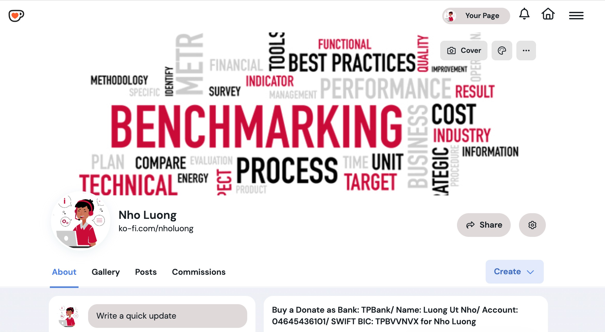

### [View all Roadmaps](https://github.com/nholuongut/all-roadmaps) &nbsp;&middot;&nbsp; [Best Practices](https://github.com/nholuongut/all-roadmaps/blob/main/public/best-practices/) &nbsp;&middot;&nbsp; [Questions](https://www.linkedin.com/in/nholuong/)
 

<h1 align="center">I'm **Nho Luong** from Ho Chi Minh City, Viet Nam🇻🇳</h1>
<h3 align="center">DevOps Engineer focused on automation and cloud technologies for efficiency.</h3>

  

## **Hi There** 👋,

- I'm an experienced **DevOps Engineer** with a strong background in both on-premises and cloud platforms (Azure, AWS, GCP and DigitalOcean), CI/CD implementation, and infrastructure automation. Skilled in IaC, containerization, Kubernetes, and various DevOps tools.
- I keep contributing to various **open-source** projects and building DevOps repositories for everyone to explore, learn, practice and work on DevOps efficency.
- Ask me **about DevOps, Cloud Computing (AWS, Microsoft Azure), Kubernetes, Python, Linux System Administration, Git, Docker, Terraform, Jenkins, Ansible, Bash Scripting, Cybersecurity, Web Services, MongoDB, MySQL, SQL, React.js, HTML, CSS, Java, C++, Data Structures, C (Programming Language).**

### 🔭 I’m currently working on
- [Microservices Reference Implementation](https://github.com/nholuongut/microservices-reference-implementation)
- [Azure Terraform Infrastructure](https://github.com/nholuongut/azure-terraform-infrastructure)
- [AWS Terraform Infrastructure](https://github.com/nholuongut/terraform-aws-modules)
- [Ansible Automation Platform](https://github.com/nholuongut/azure-terraform-infrastructure)
### 🌱 I’m currently Pratices on 
- [Devops Exercises](https://github.com/nholuongut/devops-exercises)
### 📝 I regularly write articles on 
- [Github Repositories](https://github.com/nholuongut?tab=repositories)

# **About me**

- ♾️ DevOps Engineer
- ⭐ Open-source Contributor
- ✍️ Blogger
- 📚 Always learning something new
- ⚽ Football player
- 📫 How to reach me: luongutnho@hotmail.com
- 😄 Pronouns: Mr. Nho Luong

# **My Projects**

-  🚀 My Github Repositories [**GitHub Repositories**](https://github.com/nholuongut?tab=repositories) for a central DevOps learning and practical with all my projects.
- 🏗️ Below are my highlight repositories:
   - ➡️ [**devops-basics**](https://github.com/nholuongut/devops-basics): 🚀 Practical and document place for DevOps skill.
   - ➡️ [**devops-toolkit**](https://github.com/nholuongut/devops-toolkit): 🐳 Container image for an all-in-one DevOps environment with popular tools
   - ➡️ [**devops-architecture**](https://github.com/nholuongut/devops-architecture): A place to learn and practice DevOps in a hands-on way 🎮
   - ➡️ [**local-env**](https://github.com/nholuongut/local-env): 🐳 LocalEnv - Local Containerized Environment supports various languages.
   - ➡️ [**kubernetes-labs**](https://github.com/nholuongut/kubernetes-labs): Kubernetes deployment samples, practices and examples.
   - ➡️ [**cmd**](https://github.com/nholuongut/cli-commands-reference): A bookmark for my daily used command line 
- 👀 Checkout my full repositories landscape ➡️ [**here**](https://github.com/nholuongut?tab=repositories) 🚀
   - ➡️ [**microservices-deployment**](https://github.com/nholuongut/microservices-deployment-sample): Sample microservices deployment on k8s with proxy, monitoring and logging features.
   - ➡️ [**azure-services-learning-resources**](https://github.com/nholuongut/azure-services-learning-resources): 📚 Collection of Azure Services documentation and learning resources.
   - ➡️ [**aws-hub-repository-docs**](https://github.com/nholuongut/aws-hub-repository-docs): 📚 Collection of AWS Services documentation and learning resources.

<h1 align="left">Languages and Tools:</h1>

                

## 🚀 I'm are always open to your feedback.  Please contact as bellow information

# **[Contact ]**
* [Name: Nho Luong]
* [Skype](luongutnho_skype)
* [Github](https://github.com/nholuongut/)
* [Linkedin](https://www.linkedin.com/in/nholuong/)
* [Email Address](luongutnho@hotmail.com)
* [PayPal.Me](https://www.paypal.com/paypalme/nholuongut)

# License
* Nho Luong (c). All Rights Reserved.🌟
